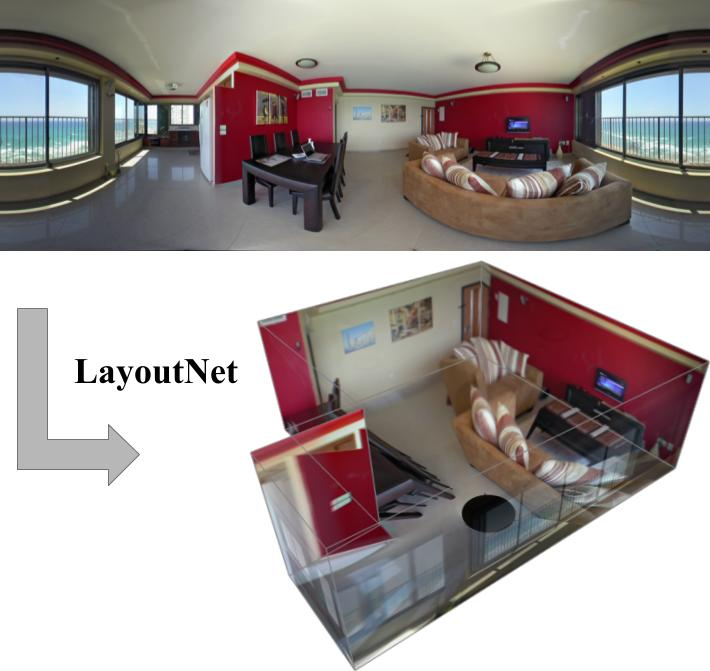

# LayoutNet
Torch implementation for CVPR 18 [paper](http://openaccess.thecvf.com/content_cvpr_2018/papers/Zou_LayoutNet_Reconstructing_the_CVPR_2018_paper.pdf): "LayoutNet: Reconstructing the 3D Room Layout from a Single RGB Image"

See sample [video](https://youtu.be/WDzYXRP6XDs) of 3D reconstruced layouts by our method.



## Third party implementation
- PyTorch [implementation](https://github.com/sunset1995/pytorch-layoutnet) by [sunset1995](https://github.com/sunset1995)

## Prerequisites
- Linux
- NVIDIA GPU + CUDA CuDNN
- Torch 7

matio: https://github.com/tbeu/matio

- Matlab

## Data
- Download preprocessed (aligned to horizontal floor plane) training/validation/testing [data](https://drive.google.com/file/d/1vsIvZ5L-VT0sH-GgbUL1sRYiEHn2Jn3B/view?usp=sharing) to current folder

This includes the panoramas from both the panoContext dataset and our labeled stanford 2d-3d dataset.

- Download groundtruth [data](https://drive.google.com/file/d/1j91sz8Jt6Jsg198riA0ggz8Mjj4lSntx/view?usp=sharing) to current folder

This includes the groundtruth 2D position of room corners in .mat format from the two dataset. We've corrected some wrong corner labels in PanoContext to match the layout boundaries.

- Download preprocessed LSUN training/validation/testing [data](https://drive.google.com/file/d/1BSYquS7LietkRiyZMxBlqtY8uZSIsUUg/view?usp=sharing) and related [.t7](https://drive.google.com/file/d/1QO9MioPRKUBKq_sEh06-nk8xAAohzueD/view?usp=sharing) file under /data/LSUN\_data/ folder. We've corrected 10% wrong corner labels.

## Pretrained model
- Download our pretrained [model](https://drive.google.com/file/d/1bg9ZP3_KA1kvTWpCh4wQ0PfAuCm4j0qa/view?usp=sharing) to current folder. This includes:

1) The pretrained full approach on the panoContext dataset, the joint boudary and corner prediction branch, the single boundary prediction branch and the 3D layout box regressor;

2) The pretrained full approach on the LSUN dataset (we've corrected 10% wrong labels), the joint boudary and corner prediction branch and the single boundary prediction branch.

## Image preprocess
We provide sample script to extract Manhattan lines and align the panorama in ./matlab/getManhattanAndAlign.m.

To get gt edge map, corner map and box parameters, see sample script ./matlab/preprocessPano.m

To convert gt data to .t7 file, see sample code preProcess\_pano.lua

## Train network
- To train our full approach:
```
th driver_pano_full.lua
```
Note that this loads the pretrained joint prediction branch and the 3D layout box regressor.

- To train the joint prediction branch of boudary and corner:
```
th driver_pano_joint.lua
```
Note that this loads the pretrained boundary prediction branch.

- To train the boudary prediction branch:
```
th driver_pano_edg.lua
```
- To train the layout box regressor:
```
th driver_pano_box.lua
```

## Test network
- To test on our full approach:
```
th testNet_pano_full.lua
```
This saves predicted boundary, corner and 3D layout parameter in "result/" folder.

## Optimization
- To Add Manhattan constraints and optimize for a better layout, open Matlab, then:
```
cd matlab
panoOptimization.m
```
This loads saved predictions from the network output and performs sampling.

## Evaluation

We provide the Matlab evaluation code for 3D IoU (compute3dOcc\_eval.m) and the generation of 2D layout label (getSegMask\_eval.m) for evaluating layout pixel accuracy.

## Extension to perspective images
- To train our full approach:
```
th driver_persp_joint_lsun_type.lua
```
Note that this loads the pretrained joint corner and boundary prediction branch.

- To train the joint prediction branch of boudary and corner:
```
th driver_persp_joint_lsun.lua
```
Note that this loads the pretrained boundary prediction branch.
- To train the boudary prediction branch:
```
th driver_persp_lsun.lua
```
## Citation
Please cite our paper for any purpose of usage.
```
@inproceedings{zou2018layoutnet,
  title={LayoutNet: Reconstructing the 3D Room Layout from a Single RGB Image},
  author={Zou, Chuhang and Colburn, Alex and Shan, Qi and Hoiem, Derek},
  booktitle={Proceedings of the IEEE Conference on Computer Vision and Pattern Recognition},
  pages={2051--2059},
  year={2018}
}
```
